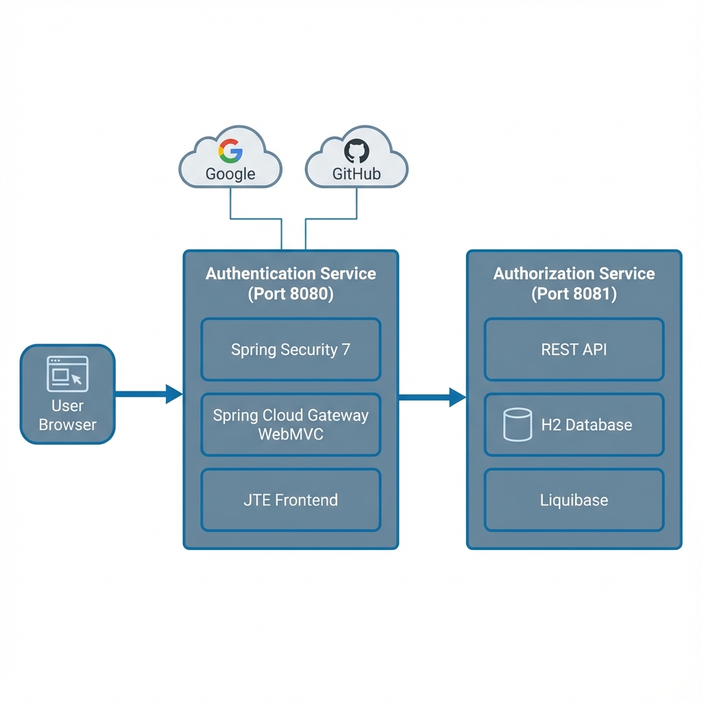
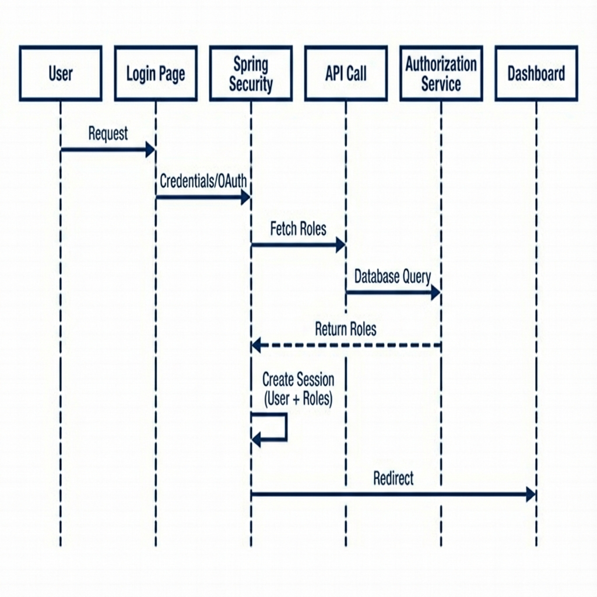

# The Definitive Developer Guide - Spring Boot 4.0 Microservices

> **Version:** 1.0.0  
> **Last Updated:** 2025-12-27  
> **Tech Stack:** Spring Boot 4.0.1, Spring Cloud 2025.1.0 (Oakwood), Java 25

---

## 📚 Table of Contents
1. [Chapter 1: Integration & Architecture (The Big Picture)](#chapter-1-integration--architecture)
2. [Chapter 2: The Frontend (Authentication Service)](#chapter-2-the-frontend-authentication-service)
3. [Chapter 3: The Backend (Authorization Service)](#chapter-3-the-backend-authorization-service)
4. [Chapter 4: Critical Flows Deep Dive](#chapter-4-critical-flows-deep-dive)
5. [Chapter 5: Developer Tools & Tricks](#chapter-5-developer-tools--tricks)

---

## Chapter 1: Integration & Architecture

### 1.1 The "Why"
In a traditional monolithic application, *Authentication* (Who are you?) and *Authorization* (What can you do?) are often mixed together in the same database tables and code. 

**Why we separated them:**
*   **Security Isolation:** The database containing User Roles is *physically separated* from the public internet. No one can hit the database service directly except our own Frontend.
*   **Scalability:** We can scale the Frontend (which handles heavy traffic, HTML rendering, and session management) independently from the Backend (which is a lightweight JSON API).
*   **Modern Standards:** This mimics how large-scale enterprise systems work (e.g., Google login vs. Google Drive permissions).

### 1.2 The Architecture Diagram

### 1.3 Key Concepts for Apprentices

| Concept | Explanation | Real-World Analogy |
| :--- | :--- | :--- |
| **Reverse Proxy** | A server that sits in front of other servers and forwards client requests to them. | A hotel concierge. You ask them for a towel, they call housekeeping. You never talk to housekeeping directly. |
| **Circuit Breaker** | (Implemented via Gateway) Stops calling a service if it's dead, preventing system-wide failure. | A fuse in your house. If the microwave is shorting out, the fuse blows so the house doesn't burn down. |
| **Stateful vs Stateless** | **Stateful:** The server remembers you (Session ID). **Stateless:** Every request must prove who you are (JWT). | **Stateful:** A waiter remembering your order. **Stateless:** Vending machine (you must put money in every time). |

---

## Chapter 2: The Frontend (Authentication Service)

**Port:** `8080` (The only port you should open in your browser)

This service wears two hats: it is a **Web Server** (serving HTML pages) and a **Gateway** (routing traffic).

### 2.1 Technology: Spring Cloud Gateway Server WebMVC
*   **What is it?** A blocking, Servlet-based API Gateway.
*   **Why not WebFlux?** Previous versions used "Spring Cloud Gateway" which ran on Netty (Reactive). This was fast but hard to debug and incompatible with traditional Servlet code (like H2 Console). The new **WebMVC** version runs on Tomcat and integrates perfectly with standard Spring MVC.
*   **How it works:** 
    *   It looks at your `application.yaml` routes.
    *   If a request matches `/h2-console/**`, it acts as a pipe.
    *   It adds headers like `X-Forwarded-Host` so the backend knows the user *think* they are on `localhost:8080`.

### 2.2 Technology: JTE (Java Template Engine)
*   **The Problem:** Traditional template engines (Thymeleaf) parse HTML at runtime. This is slow and error-prone (typos aren't caught until the page loads).
*   **The Solution:** JTE compiles your `.jte` files into **actual Java Class files** (`.class`) during the Maven build.
*   **Benefit 1:** **Lightning Speed.** It renders as fast as appending Strings.
*   **Benefit 2:** **Type Safety.** If you write `${user.getNmae()}` (typo), the *Java Compiler* will fail the build. You never ship broken pages.

### 2.3 Technology: Spring Security 7
*   **Filter Chain:** Think of security as a series of doors (Filters).
    1.  **Door 1:** Is this a static resource (CSS/JS)? -> User passes.
    2.  **Door 2:** Is this the login page? -> User passes.
    3.  **Door 3:** Is this the Dashboard? -> **HALT.** Do you have a Session Session?
        *   **No:** Redirect to Login.
        *   **Yes:** Proceed.
*   **OAuth2 Client:** We use the "Authorization Code Grant" flow.
    *   We don't see the user's Google password.
    *   Google sends us a "Code".
    *   We trade that "Code" for an "Access Token".
    *   We ask Google "Who owns this token?" -> Google replies "alice@gmail.com".

---

## Chapter 3: The Backend (Authorization Service)

**Port:** `8081` (Hidden network)

### 3.1 Technology: H2 Database (In-Memory)
*   **Concept:** It's a real SQL database, but it lives entirely in RAM.
*   **Pros:** Zero installation. Fast. Perfect for dev.
*   **Cons:** If you restart the server, **all data is lost.**
*   **Connection:** JDBC URL `jdbc:h2:mem:rolesdb`.

### 3.2 Technology: Liquibase ("Database as Code")
*   **The Problem:** Manually running SQL scripts (`CREATE TABLE...`) is dangerous. What if you run it twice?
*   **The Solution:** Liquibase.
*   **Changelogs:** Located in `src/main/resources/db/changelog/`.
    *   Liquibase keeps a special table `DATABASECHANGELOG`.
    *   On startup, it checks this table.
    *   "Have I run changeset #1?" -> **Yes** -> Skip.
    *   "Have I run changeset #2?" -> **No** -> Run SQL, then mark as Done.

### 3.3 The API Contract
The backend exposes a single critical endpoint:
*   **GET** `/api/authorization/roles/{userIdentifier}`
*   **Input:** `google:alice@gmail.com`
*   **Output:** `["ROLE_ADMIN", "ROLE_EDITOR"]`
This is how we separate Auth (Google knows Alice) from Authz (We know Alice is an Editor).

---

## Chapter 4: Critical Flows Deep Dive

### 4.1 The Role Lookup Flow (The "Handshake")

1.  **Event:** User logs in successfully on Frontend.
2.  **Trigger:** `OAuth2UserService` (for Google) or `UserDetailsService` (for Form) runs.
3.  **Action:** Calls `AuthorizationClientService.getRolesForUser()`.
4.  **Network Call:** Frontend -> HTTP GET -> Backend (Port 8081).
5.  **Query:** Backend asks H2: `SELECT role FROM assignments WHERE user = ?`.
6.  **Response:** Backend returns JSON list.
7.  **Finalize:** Frontend stamps these roles into the `Authentication` object in the session.

### 4.2 The H2 Console Proxy Problem
*   **Scenario:** You want to see the database, but it's on the backend (8081). You are on the frontend (8080).
*   **The Attempt:** The Gateway proxies `/h2-console` to 8081.
*   **The Fail:** The H2 Console returns HTML saying `<form action="http://localhost:8081/login">`.
*   **The Result:** When you click "Connect", your browser obeys the HTML and jumps to port 8081 directly.
*   **The Lesson:** Gateways are great for APIs (JSON), but imperfect for Web Apps (HTML) unless they are smart enough to rewrite the HTML body (which Spring Cloud Gateway WebMVC is not... yet).

---

## Chapter 5: Developer Tools & Tricks

### 5.1 Maven Wrapper Removed
We removed `./mvnw` to keep the repo clean.
*   **Apprentice Tip:** Always run `mvn -version` to ensure you are on Java 25.
*   **Command:** Use `mvn spring-boot:run` instead of `./mvnw spring-boot:run`.

### 5.2 Accessing the Database
The Dashboard now has an **Admin Tools** section (visible only to Admins).
*   **Recommended:** Use the "Direct Access" link (goes to 8081).
*   **Credentials:** Username `sa` / Password is in the console logs (search for `H2DatabaseConfig`).

### 5.3 Troubleshooting "White Page" Errors
If you see a "White Label Error":
1.  **Check Logs:** Is there a `Connection refused`? (Backend might be down).
2.  **Check Security:** Are you trying to access `/dashboard` without logging in?
3.  **Check H2:** Did you restart? The H2 password changes every time!

---

> **Final Note for Apprentices:**
> Microservices are complex because *network calls are unreliable*. In a monolith, calling a function always works. In microservices, calling another service might fail (timeout, downtime). Always code defensively!
